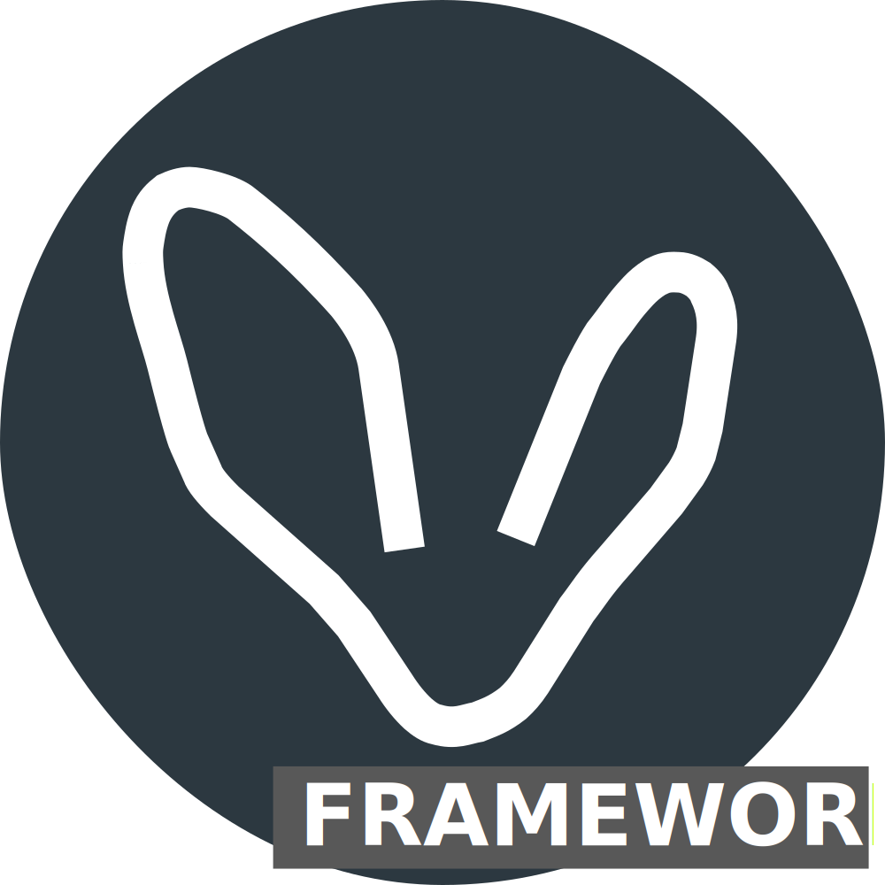

<h2>About</h2>
The previous decade has seen a surge in tools designed to simplify the provisioning of cloud infrastructures, on-premise and dedicated servers. While this development is positive, assembling and configuring these tools remains challenging. This task is time-intensive, requiring substantial expertise in cloud systems, Infrastructure as Code (IaC), Linux, cybersecurity, etc.

For many who only require an environment for running a few server-side applications, a VPN, blogs, email servers, and file managers, adhering to best practices and ensuring security can be daunting and time-consuming.

Amadla simplifies this process by automating the establishment of a basic environment suitable for personal use to all-sized businesses. It also helps by abstracting many aspects of setting up applications, servers and cloud infrastructures.

<h2>Main Projects</h2>

 <a href="https://github.com/AmadlaOrg/amadla-cli"> amadla-cli</a> = <strong>Simple terminal application to use Amadla</strong>

 <a href="https://github.com/AmadlaOrg/Amadla-Framework"> Amadla-Framework</a> = <strong>The Amadla-Framework is a <a href="https://docs.github.com/en/repositories/creating-and-managing-repositories/creating-a-repository-from-a-template" title="Creating a repository from a template">template</a> you can use to start your project</strong>

<!--

**Here are some ideas to get you started:**

🙋‍♀️ A short introduction - what is your organization all about?
🌈 Contribution guidelines - how can the community get involved?
👩‍💻 Useful resources - where can the community find your docs? Is there anything else the community should know?
🍿 Fun facts - what does your team eat for breakfast?
🧙 Remember, you can do mighty things with the power of [Markdown](https://docs.github.com/github/writing-on-github/getting-started-with-writing-and-formatting-on-github/basic-writing-and-formatting-syntax)
-->
