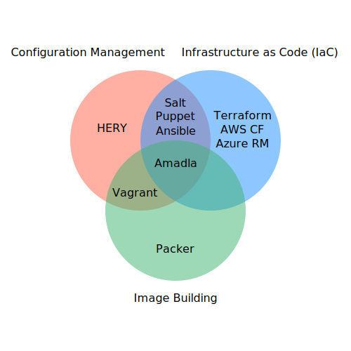

<h2>About</h2>

:warning: :construction: **Still in the works** :construction: :warning:

In the last decade, there has been a surge in tools designed to simplify the provisioning of cloud infrastructures, on-premise, and dedicated servers. While these tools offer significant benefits, setting them up and configuring them can be challenging, requiring considerable expertise in cloud systems, Infrastructure as Code (IaC), Linux, cybersecurity, and more. Many of these tools fall short of fully abstracting system-specific configurations, often necessitating detailed and complex setups.

For users who only need an environment to run a few server-side applications—like a VPN, blogs, email servers, or file managers—maintaining best practices and ensuring security can be daunting and time-consuming. Amadla aims to streamline this process by automating the setup of a basic environment suitable for personal use and businesses of all sizes. It simplifies the configuration of applications, servers, and cloud infrastructures by providing a solid abstraction layer.

<h2>How Amadla Works?</h2>

Using a custom storage methodology that merges [YAML](https://en.wikipedia.org/wiki/YAML), [JSON-Schema](https://json-schema.org/) and [Git](https://git-scm.com/), Amadla configurations will feel familiar to most and innovative at the same time. The name for this storage device is [HERY](https://github.com/AmadlaOrg/hery). In short, it is an extension to [YAML](https://en.wikipedia.org/wiki/YAML) by which [YAML](https://en.wikipedia.org/wiki/YAML) content is grouped into what is named entities. Each entity can refer to other entities. Making it similar to an RDBMS but with the content being in text given the benefit of CVS with [Git](https://git-scm.com/).

It also comes with a caching system based on [SQLite](https://www.sqlite.org/) that permits quick querying of the configuration content.

From [HERY](https://github.com/AmadlaOrg/hery) [Amadla-cli](https://github.com/AmadlaOrg/amadla-cli) queries for the configurations and then using [Jinja2](https://jinja.palletsprojects.com/) populates configuration templates.

Each of these entities is a block of configuration standards that are mutable. Entities can be invented by anyone for any purpose. The ones created by Amadla can be used or just ignored. There are no obligations. However, using a predefined entity offers a better integration with other tools and templates. Each entity informs different parts of a service and infrastructure or multiple parts. For example, the `Net` entity that can be attached to an application can indicate to the HTTP server the networking requirements of a website and also inform the firewall configurations about what ports to keep open for said website requirements. These configurations are also merged in a cascading way so an entity can overwrite the default configurations of the previous layered entity.

> This is an abstract explanation. Later examples will be provided.

<!--<h2>Main Projects</h2>

 <a href="https://github.com/AmadlaOrg/amadla-cli"> amadla-cli</a> = <strong>Simple terminal application to use Amadla</strong>

-->

<!--

 <a href="https://github.com/AmadlaOrg/amadla-template"> amadla-template</a> = <strong>The Amadla template is a <a href="https://docs.github.com/en/repositories/creating-and-managing-repositories/creating-a-repository-from-a-template" title="Creating a repository from a template">template</a> you can use to start with Amadla</strong>

-->

<!--

**Here are some ideas to get you started:**

🙋‍♀️ A short introduction - what is your organization all about?
🌈 Contribution guidelines - how can the community get involved?
👩‍💻 Useful resources - where can the community find your docs? Is there anything else the community should know?
🍿 Fun facts - what does your team eat for breakfast?
🧙 Remember, you can do mighty things with the power of [Markdown](https://docs.github.com/github/writing-on-github/getting-started-with-writing-and-formatting-on-github/basic-writing-and-formatting-syntax)
-->
